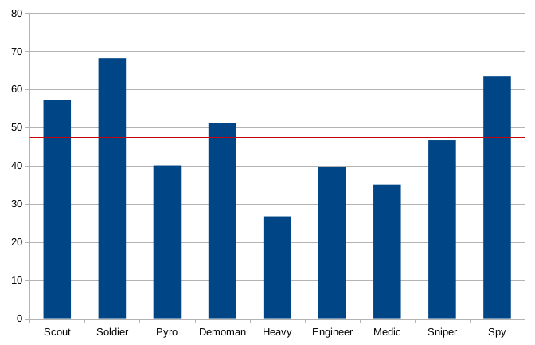

# TF2Playtime

Calculates the average playtime for all Team Fortress 2 classes of all members of a Steam group. I finished it in 2 days, so the code isn't very pretty.

## Usage

Copy your Steam Web API key into a file called `key.txt`.

    mkdir group
    mkdir stats
    ./dl.sh
    python3 collect_ids.py
    python3 dlstats.py
    python3 genstats.py

The last script prints the results to the terminal.

## Result

Image generated using LibreOffice Calc.

## Cache

Profile "names" are cached in `vanitycache.json`  
Steam HTML files are cached in `group/`  
User stats are cached in `stats`  

## License

[WTFPL](LICENSE)

